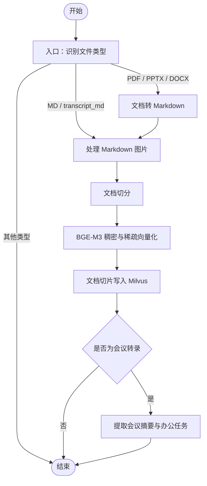
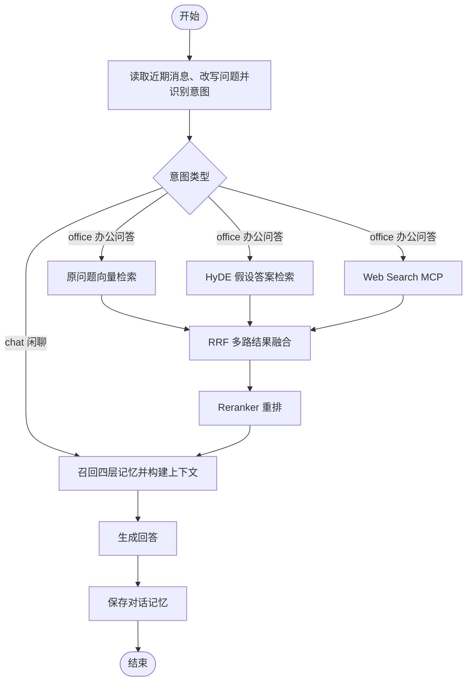

# HVIYI

HVIYI 是一个面向个人使用的本地会议办公助手。它以“会议”为核心组织录音、转录、资料、问答、记忆与待办任务，提供实时语音识别、会议资料导入、RAG 问答和会议记忆管理等能力。

## 核心能力

- **会议管理**：创建会议、维护会议状态，并统一管理会议资料、录音、对话和任务。
- **实时转录**：浏览器采集麦克风音频，通过 WebSocket 发送 16 kHz PCM 音频，后端使用 FunASR 流式识别。
- **文档知识库**：支持导入 PDF、PPTX、DOCX 和 Markdown，完成解析、切分、向量化与 Milvus 入库。
- **会议问答**：基于 LangGraph 编排问题改写、多路检索、RRF 融合、Reranker 重排、上下文构建和回答生成。
- **会议记忆**：通过统一的 `MemoryManager` 管理短期对话、会议经历、语义历史和办公进度四层记忆。
- **任务提取**：会议转录导入后，可提取会议元信息和办公任务，并在前端持续更新完成进度。

## 项目结构

```text
HVIYI/
├─ app/
│  ├─ api/                 # FastAPI 统一入口、会议与实时 ASR 接口
│  ├─ graph/
│  │  ├─ import_process/   # 文档导入工作流
│  │  └─ query_graph/      # RAG 问答工作流
│  ├─ memory/              # 四层记忆与统一 MemoryManager
│  ├─ clients/             # MySQL、MongoDB、Milvus、MinIO、Redis 客户端
│  ├─ asr/                 # FunASR 流式识别
│  └─ lm/                  # LLM、Embedding 与 Reranker
├─ front/                  # React + Vite 前端
├─ prompts/                # 问答、压缩、HyDE、会议提取等提示词
├─ prepare/                # 模型下载与数据准备脚本
├─ tests/                  # ASR、记忆缓存与本机用户接口测试
└─ docker-compose.yml      # 本地基础服务
```

## 核心设计


### 1. 两条 LangGraph 工作流

**Import Graph：文档导入流程**



PDF、PPTX、DOCX 需要先转换为 Markdown；普通 Markdown 和会议转录 Markdown 会跳过格式转换。只有会议转录在完成向量入库后，才继续提取会议摘要和办公任务。

**Query Graph：问答流程**



闲聊不会执行文档和网络检索，而是直接结合四层记忆构建上下文；办公问答会并行执行原问题检索、HyDE 检索和 Web 检索，再经过 RRF 与 Reranker 后进入回答阶段。流式请求通过 SSE 输出执行进度和最终结果。


### 2. 四层会议记忆

| 记忆层 | 主要内容 | 存储 |
| --- | --- | --- |
| L1 短期记忆 | 当前会话消息与滚动摘要 | MySQL + Redis 缓存 |
| L2 情景记忆 | 会议摘要、参会信息和本机用户画像 | MongoDB + Redis 缓存 |
| L3 语义记忆 | 可检索的历史对话 | MySQL + Milvus |
| L4 办公进度 | 待办任务、负责人、截止时间和进度 | MySQL + Redis 缓存 |


### 3. 存储职责分离

- **MySQL**：会议、文档状态、转录片段、聊天消息和办公任务等结构化数据。
- **MongoDB**：会议情景记忆与本机用户画像。
- **Milvus**：文档切片和历史对话的向量检索。
- **MinIO**：上传的文档与图片对象。
- **Redis**：热点记忆缓存。

## 技术栈

- 后端：Python 3.12、FastAPI、LangGraph、SQLAlchemy
- AI：OpenAI 、FunASR、BGE-M3、BGE Reranker、MinerU
- 数据：MySQL、MongoDB、Milvus、MinIO、Redis
- 前端：React、TypeScript、Vite

## 快速开始

### 1. 准备环境

请先安装：

- Python 3.12
- [uv](https://docs.astral.sh/uv/)
- Node.js 与 npm
- Docker Desktop（用于启动本地数据服务）

### 2. 启动基础服务

复制 Compose 配置并填写密码：

```powershell
Copy-Item compose.env.example compose.env
docker compose --env-file compose.env up -d
```

该命令会启动 MySQL、MongoDB、Redis、MinIO、etcd 和 Milvus，端口默认只绑定到 `127.0.0.1`。

### 3. 配置并启动后端

安装 Python 依赖：

```powershell
uv sync
```


启动统一 API 服务：

```powershell
uv run uvicorn app.api.main:app --host 127.0.0.1 --port 8000 --reload
```

启动后可访问：

- 健康检查：<http://127.0.0.1:8000/health>
- Swagger 接口文档：<http://127.0.0.1:8000/docs>

### 4. 启动前端

打开另一个终端：

```powershell
cd front
npm.cmd install
npm.cmd run dev
```

浏览器访问 <http://127.0.0.1:5173>。
