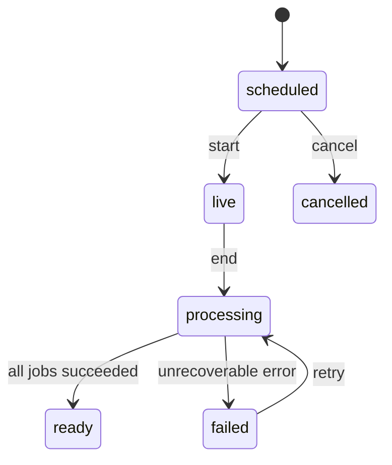

# HVIYI 前端接口文档

版本：`v1.0`  
面向：会议办公助手 Web 前端  
建议后端：FastAPI / REST + WebSocket + SSE

## 1. 协议总览

| 场景 | 协议 | 用途 |
|---|---|---|
| 登录、会议、文档、总结、图谱 | HTTPS REST | 普通请求与分页查询 |
| 会议实时转写 | WebSocket | 浏览器持续上传音频，服务端推送 partial/final 转写 |
| 会后处理进度 | SSE | 推送解析、切分、向量化、总结生成状态 |
| RAG 回答 | SSE | 推送检索阶段、引用来源、答案增量与完成事件 |
| 文件上传 | 对象存储直传 | 后端签发预签名 URL，前端 PUT 上传后确认 |

开发环境默认地址：

```text
REST:      http://localhost:8000/api/v1
WebSocket: ws://localhost:8000/ws/v1
```

生产环境必须使用 `https://` 与 `wss://`。

## 2. 通用约定

### 2.1 请求头

```http
Authorization: Bearer <access_token>
Content-Type: application/json
X-Request-ID: 8c7af0b0-a826-4ab1-879e-2b5607aa3db9
Idempotency-Key: 56ff4cbb-947c-4c9b-a268-cdd191ea4593
```

- `Authorization`：除登录和刷新令牌外必传。
- `X-Request-ID`：推荐由前端生成 UUID，方便排查全链路日志。
- `Idempotency-Key`：创建会议、开始/结束会议、完成上传、重新生成总结等写操作必传。同一用户、同一路径、同一 Key 应返回相同结果。

### 2.2 时间、ID 与字段风格

- 时间统一为 ISO 8601 UTC，例如 `2026-08-19T06:30:00Z`；前端按用户时区显示。
- 主键统一使用不可枚举字符串，例如 UUIDv7。
- JSON 字段统一为 `snake_case`。
- 未知字段前端忽略，后端不得复用既有字段表达新语义。
- 空集合返回 `[]`，不返回 `null`。

### 2.3 成功返回

单对象：

```json
{
  "data": {
    "id": "mtg_01J5P4C8Y0..."
  },
  "request_id": "8c7af0b0-a826-4ab1-879e-2b5607aa3db9"
}
```

游标分页：

```json
{
  "data": [],
  "page": {
    "next_cursor": "eyJpZCI6Im10Z18xMjMifQ==",
    "has_more": true,
    "total": 32
  },
  "request_id": "..."
}
```

### 2.4 错误返回

```json
{
  "error": {
    "code": "MEETING_STATE_CONFLICT",
    "message": "只有进行中的会议可以结束",
    "details": {
      "current_status": "processing"
    },
    "retryable": false
  },
  "request_id": "..."
}
```

| HTTP | 使用场景 |
|---|---|
| `400` | 参数格式错误 |
| `401` | 未登录、令牌过期 |
| `403` | 无会议/文档访问权限 |
| `404` | 资源不存在，或为了防止越权枚举而隐藏资源 |
| `409` | 会议状态冲突、重复操作 |
| `413` | 上传文件超过限制 |
| `422` | 字段校验失败 |
| `429` | 请求或模型额度超限 |
| `500` | 不可预期服务端错误 |
| `503` | ASR、向量库、模型等依赖暂不可用 |

前端按 `error.code` 处理业务分支，不解析自然语言 `message`。

### 2.5 权限与引用底线

- 后端必须基于当前用户和空间权限计算可访问的 `meeting_id`、`document_id`，再注入数据库和向量检索过滤条件。
- 模型输出的 ID、用户问题中出现的 ID 都不能作为授权凭据。
- RAG 答案的事实段必须返回 `source_refs`，可定位到会议发言时间戳或文件页码。
- 任何权限不足的来源不得出现在召回结果、流式事件、日志或错误详情中。

## 3. 核心枚举

```ts
type MeetingStatus =
  | 'scheduled'
  | 'live'
  | 'processing'
  | 'ready'
  | 'failed'
  | 'cancelled'

type ProcessingStage =
  | 'persisting_media'
  | 'parsing_documents'
  | 'chunking'
  | 'embedding'
  | 'extracting_entities'
  | 'generating_summary'
  | 'completed'

type DocumentStatus =
  | 'uploading'
  | 'uploaded'
  | 'parsing'
  | 'indexed'
  | 'failed'

type SourceKind = 'transcript' | 'document'
type GraphNodeType = 'meeting' | 'person' | 'topic' | 'decision' | 'document'
```

会议状态机：



## 4. 认证与用户

### 4.1 登录

`POST /auth/login`

```json
{
  "email": "demo@hive.ai",
  "password": "hive2026",
  "remember_me": true
}
```

```json
{
  "data": {
    "access_token": "eyJ...",
    "token_type": "Bearer",
    "expires_in": 900,
    "user": {
      "id": "usr_01...",
      "name": "林知夏",
      "email": "demo@hive.ai",
      "avatar_url": null,
      "timezone": "Asia/Shanghai",
      "workspace": {
        "id": "wsp_01...",
        "name": "林知夏的空间",
        "role": "owner"
      }
    }
  },
  "request_id": "..."
}
```

建议：access token 仅保存在内存；refresh token 由后端写入 `HttpOnly; Secure; SameSite=Lax` Cookie。

### 4.2 刷新、登出、当前用户

| 方法 | 路径 | 说明 |
|---|---|---|
| `POST` | `/auth/refresh` | 使用 HttpOnly Cookie 刷新 access token |
| `POST` | `/auth/logout` | 吊销 refresh token 并清 Cookie |
| `GET` | `/users/me` | 返回当前用户、空间和权限 |

`GET /users/me` 需返回权限数组：

```json
{
  "data": {
    "id": "usr_01...",
    "name": "林知夏",
    "permissions": [
      "meeting:create",
      "meeting:read",
      "meeting:record",
      "document:upload",
      "rag:query"
    ]
  }
}
```

## 5. 首页数据

### 5.1 首页聚合

`GET /dashboard?timezone=Asia%2FShanghai`

一次返回首页需要的数据，避免前端发起过多并行请求。

```json
{
  "data": {
    "next_meeting": {
      "id": "mtg_01...",
      "title": "Q3 产品策略共创会",
      "scheduled_start_at": "2026-08-19T06:30:00Z",
      "duration_minutes": 45,
      "participant_count": 6
    },
    "weekly_stats": {
      "meeting_count": 12,
      "meeting_count_change_rate": 0.18,
      "knowledge_duration_seconds": 30960,
      "open_action_item_count": 18,
      "due_this_week_count": 5,
      "rag_query_count": 46,
      "citation_coverage_rate": 1.0
    },
    "recent_meetings": [],
    "insight": {
      "title": "AI 本周洞察",
      "content": "可追溯问答在 5 场会议中被反复提及。",
      "related_node_ids": ["topic_01..."]
    }
  }
}
```

## 6. 会议

### 6.1 创建会议

`POST /meetings`

```json
{
  "title": "Q3 产品策略共创会",
  "scheduled_start_at": "2026-08-19T06:30:00Z",
  "agenda": [
    { "title": "上轮行动项回顾", "duration_minutes": 10 },
    { "title": "Q3 核心目标讨论", "duration_minutes": 25 }
  ],
  "participant_user_ids": ["usr_01...", "usr_02..."],
  "language": "zh-CN"
}
```

返回完整 `Meeting`：

```json
{
  "data": {
    "id": "mtg_01...",
    "workspace_id": "wsp_01...",
    "title": "Q3 产品策略共创会",
    "status": "scheduled",
    "scheduled_start_at": "2026-08-19T06:30:00Z",
    "started_at": null,
    "ended_at": null,
    "duration_seconds": 0,
    "language": "zh-CN",
    "owner": { "id": "usr_01...", "name": "林知夏", "avatar_url": null },
    "participants": [],
    "agenda": [],
    "document_count": 0,
    "created_at": "2026-08-19T05:40:00Z",
    "updated_at": "2026-08-19T05:40:00Z"
  }
}
```

### 6.2 会议列表与详情

`GET /meetings?status=ready&query=产品&from=2026-08-01T00:00:00Z&to=2026-09-01T00:00:00Z&cursor=&limit=20`

支持参数：

| 参数 | 类型 | 说明 |
|---|---|---|
| `status` | 可重复枚举 | 可传多个状态 |
| `query` | string | 标题、参与人、标签搜索 |
| `from` / `to` | datetime | 时间范围 |
| `owner_id` | string | 主持人 |
| `tag` | string | 标签 |
| `cursor` | string | 游标 |
| `limit` | 1–100 | 默认 20 |

其他接口：

| 方法 | 路径 | 说明 |
|---|---|---|
| `GET` | `/meetings/{meeting_id}` | 会议详情 |
| `PATCH` | `/meetings/{meeting_id}` | 修改标题、议程、参与人 |
| `DELETE` | `/meetings/{meeting_id}` | 软删除；已进行的会议进入回收站 |
| `POST` | `/meetings/{meeting_id}/cancel` | 取消未开始会议 |

### 6.3 开始会议

`POST /meetings/{meeting_id}/start`

```json
{
  "audio": {
    "mime_type": "audio/webm;codecs=opus",
    "sample_rate": 48000,
    "channels": 1
  },
  "transcription": {
    "language": "zh-CN",
    "speaker_diarization": true,
    "punctuation": true
  }
}
```

```json
{
  "data": {
    "meeting": { "id": "mtg_01...", "status": "live", "started_at": "2026-08-19T06:30:03Z" },
    "realtime": {
      "websocket_url": "wss://api.example.com/ws/v1/meetings/mtg_01.../transcription",
      "ticket": "one_time_ticket",
      "ticket_expires_in": 60,
      "resume_from_sequence": 0
    }
  }
}
```

不要把长期 access token 放在 WebSocket URL。使用 60 秒内失效、仅能使用一次的 ticket。

### 6.4 结束会议

`POST /meetings/{meeting_id}/end`

```json
{
  "client_ended_at": "2026-08-19T07:15:12Z",
  "last_audio_sequence": 10824,
  "generate_summary": true
}
```

```json
{
  "data": {
    "meeting": {
      "id": "mtg_01...",
      "status": "processing",
      "ended_at": "2026-08-19T07:15:13Z",
      "duration_seconds": 2710
    },
    "processing_job": {
      "id": "job_01...",
      "status": "queued",
      "progress": 0,
      "events_url": "/api/v1/jobs/job_01.../events"
    }
  }
}
```

结束会议是幂等操作。重复请求不得重复生成总结或重复入库。

## 7. 实时转写 WebSocket

连接：

```text
GET /ws/v1/meetings/{meeting_id}/transcription?ticket=<one_time_ticket>
```

### 7.1 客户端控制消息

连接建立后先发送：

```json
{
  "type": "session.configure",
  "audio": {
    "mime_type": "audio/webm;codecs=opus",
    "sample_rate": 48000,
    "channels": 1,
    "chunk_duration_ms": 250
  },
  "resume_from_sequence": 0
}
```

音频用 WebSocket binary frame 上传，避免 Base64 增加约 33% 体积。每个二进制音频帧前 8 字节建议为无符号大端序 `sequence`，其余为 MediaRecorder 产生的 Opus 数据。若后端不采用此前缀，必须另外提供 `audio.chunk` JSON 协议并在 OpenAPI 补充说明。

暂停/恢复：

```json
{ "type": "audio.pause", "last_sequence": 812 }
```

```json
{ "type": "audio.resume", "next_sequence": 813 }
```

正常结束前：

```json
{ "type": "audio.commit", "last_sequence": 10824 }
```

### 7.2 服务端事件

已就绪：

```json
{
  "type": "session.ready",
  "session_id": "rts_01...",
  "accepted_mime_type": "audio/webm;codecs=opus",
  "resume_from_sequence": 0
}
```

临时转写，同一 `segment_id` 可被覆盖：

```json
{
  "type": "transcript.partial",
  "sequence": 41,
  "segment_id": "seg_01...",
  "speaker": { "id": "spk_02", "display_name": "陈屿", "confidence": 0.86 },
  "text": "技术侧已经完成文档解析",
  "start_ms": 302000,
  "end_ms": 305200,
  "stability": 0.74
}
```

最终转写，只追加不覆盖：

```json
{
  "type": "transcript.final",
  "sequence": 42,
  "segment_id": "seg_01...",
  "speaker": { "id": "spk_02", "display_name": "陈屿", "confidence": 0.93 },
  "text": "技术侧已经完成文档解析的验证，PDF 和 Word 都能保留页码信息。",
  "start_ms": 302000,
  "end_ms": 311800,
  "confidence": 0.96,
  "created_at": "2026-08-19T06:35:11.800Z"
}
```

其他事件：

```json
{ "type": "audio.ack", "last_persisted_sequence": 812 }
```

```json
{ "type": "speaker.updated", "speaker_id": "spk_02", "display_name": "陈屿" }
```

```json
{
  "type": "error",
  "code": "ASR_TEMPORARILY_UNAVAILABLE",
  "message": "实时转写暂时不可用，音频仍在保存",
  "retryable": true,
  "retry_after_ms": 1500
}
```

### 7.3 重连要求

1. 前端保存最近收到的服务端 `sequence` 和最近确认的 `last_persisted_sequence`。
2. 断线后调用 `POST /meetings/{id}/realtime-ticket` 获取新 ticket。
3. `session.configure.resume_from_sequence` 传最近已确认序号。
4. 后端重放缺失的 final segment，前端按 `segment_id` 去重。
5. 音频上传失败时前端应保留本地短暂缓冲；音频已保存但 ASR 失败时，会议结束后允许离线补转写。

## 8. 转写记录

### 8.1 获取转写

`GET /meetings/{meeting_id}/transcripts?cursor=&limit=100&from_ms=0&to_ms=600000`

```json
{
  "data": [
    {
      "id": "seg_01...",
      "meeting_id": "mtg_01...",
      "speaker": { "id": "spk_02", "display_name": "陈屿", "user_id": "usr_02..." },
      "text": "技术侧已经完成文档解析的验证。",
      "start_ms": 302000,
      "end_ms": 311800,
      "confidence": 0.96,
      "revision": 1
    }
  ],
  "page": { "next_cursor": null, "has_more": false, "total": 214 }
}
```

### 8.2 修正转写或说话人

`PATCH /meetings/{meeting_id}/transcripts/{segment_id}`

```json
{
  "text": "修正后的文本",
  "speaker_user_id": "usr_02...",
  "expected_revision": 1
}
```

后端使用 `expected_revision` 做乐观锁；冲突返回 `409 TRANSCRIPT_REVISION_CONFLICT`。

## 9. 会议文档

推荐直传流程：申请上传 → PUT 到对象存储 → 确认上传。前端不要把大文件先转发到业务 API。

### 9.1 申请上传

`POST /meetings/{meeting_id}/documents/uploads`

```json
{
  "file_name": "Q3 产品路线图.pdf",
  "content_type": "application/pdf",
  "size_bytes": 5034211,
  "sha256": "063c...f21"
}
```

```json
{
  "data": {
    "document_id": "doc_01...",
    "upload_url": "https://object.example.com/...",
    "method": "PUT",
    "headers": { "Content-Type": "application/pdf" },
    "expires_at": "2026-08-19T06:45:00Z",
    "max_size_bytes": 104857600
  }
}
```

### 9.2 确认上传

`POST /meetings/{meeting_id}/documents/{document_id}/complete`

```json
{
  "etag": "d41d8cd98f00b204e9800998ecf8427e",
  "sha256": "063c...f21"
}
```

后端校验对象存在、大小与摘要后进入 `parsing`。

### 9.3 文档列表、预览、删除

| 方法 | 路径 | 说明 |
|---|---|---|
| `GET` | `/meetings/{meeting_id}/documents` | 会议文档列表 |
| `GET` | `/documents/{document_id}` | 文档元数据、解析状态、页数 |
| `POST` | `/documents/{document_id}/preview-url` | 返回 5 分钟有效的只读预览 URL |
| `POST` | `/documents/{document_id}/download-url` | 返回短期下载 URL，并记录审计 |
| `DELETE` | `/documents/{document_id}` | 软删除并触发索引清理 |
| `POST` | `/documents/{document_id}/retry` | 重试解析或索引 |

文档对象示例：

```json
{
  "id": "doc_01...",
  "meeting_id": "mtg_01...",
  "file_name": "Q3 产品路线图.pdf",
  "content_type": "application/pdf",
  "size_bytes": 5034211,
  "page_count": 16,
  "status": "indexed",
  "progress": 1.0,
  "failure": null,
  "created_at": "2026-08-19T06:20:00Z"
}
```

## 10. 会后处理与总结

### 10.1 查询任务

`GET /jobs/{job_id}`

```json
{
  "data": {
    "id": "job_01...",
    "resource_type": "meeting",
    "resource_id": "mtg_01...",
    "status": "running",
    "stage": "embedding",
    "progress": 0.72,
    "stage_progress": 0.54,
    "message": "正在建立向量索引",
    "started_at": "2026-08-19T07:15:14Z",
    "updated_at": "2026-08-19T07:16:02Z",
    "failure": null
  }
}
```

### 10.2 任务进度 SSE

`GET /jobs/{job_id}/events`

```text
event: job.progress
id: 24
data: {"stage":"embedding","progress":0.72,"message":"正在建立向量索引"}

event: summary.ready
id: 25
data: {"meeting_id":"mtg_01...","summary_id":"sum_01..."}

event: job.completed
id: 26
data: {"progress":1.0,"completed_at":"2026-08-19T07:16:45Z"}
```

支持 `Last-Event-ID` 重连。服务端每 15 秒发送注释心跳 `: keep-alive`。

### 10.3 获取与重生成总结

| 方法 | 路径 | 说明 |
|---|---|---|
| `GET` | `/meetings/{meeting_id}/summary` | 获取当前有效总结 |
| `POST` | `/meetings/{meeting_id}/summary/regenerate` | 异步重生成，返回 job |
| `GET` | `/meetings/{meeting_id}/summary/export?format=markdown` | 导出 `markdown` / `pdf` / `docx` |

```json
{
  "data": {
    "id": "sum_01...",
    "meeting_id": "mtg_01...",
    "version": 2,
    "headline": "Q3 聚焦会议知识沉淀与可追溯问答",
    "overview": "会议明确了产品目标、质量门槛与企业试点计划。",
    "conclusions": [
      {
        "id": "con_01...",
        "content": "首版聚焦自动归档、行动项和可追溯问答。",
        "source_refs": [
          {
            "kind": "transcript",
            "meeting_id": "mtg_01...",
            "transcript_segment_id": "seg_01...",
            "speaker_name": "林知夏",
            "start_ms": 1122000,
            "end_ms": 1138000,
            "quote": "首版先聚焦自动归档……"
          }
        ]
      }
    ],
    "action_items": [],
    "topics": ["会议知识沉淀", "引用可追溯", "企业权限"],
    "generated_at": "2026-08-19T07:16:42Z",
    "model_info": { "provider": "configured-provider", "model": "configured-model" }
  }
}
```

### 10.4 行动项

| 方法 | 路径 | 说明 |
|---|---|---|
| `GET` | `/meetings/{meeting_id}/action-items` | 获取行动项 |
| `PATCH` | `/action-items/{action_item_id}` | 修改负责人、截止日、状态、标题 |

```json
{
  "assignee_user_id": "usr_03...",
  "due_at": "2026-08-22T15:59:59Z",
  "status": "in_progress",
  "expected_revision": 2
}
```

## 11. RAG 对话

### 11.1 新建对话

`POST /rag/conversations`

```json
{
  "title": null,
  "scope": {
    "meeting_ids": ["mtg_01...", "mtg_02..."],
    "document_ids": [],
    "include_all_accessible": false
  }
}
```

```json
{
  "data": {
    "id": "conv_01...",
    "title": "新对话",
    "scope": {
      "meeting_count": 2,
      "document_count": 5,
      "meeting_ids": ["mtg_01...", "mtg_02..."]
    },
    "created_at": "2026-08-19T08:00:00Z"
  }
}
```

### 11.2 对话列表与消息

| 方法 | 路径 | 说明 |
|---|---|---|
| `GET` | `/rag/conversations?cursor=&limit=30` | 历史对话 |
| `GET` | `/rag/conversations/{conversation_id}` | 对话与知识范围 |
| `PATCH` | `/rag/conversations/{conversation_id}` | 修改标题或知识范围 |
| `DELETE` | `/rag/conversations/{conversation_id}` | 删除对话 |
| `GET` | `/rag/conversations/{conversation_id}/messages?cursor=&limit=50` | 消息列表 |

### 11.3 流式提问

`POST /rag/conversations/{conversation_id}/messages:stream`

请求头：

```http
Accept: text/event-stream
Content-Type: application/json
```

请求体：

```json
{
  "content": "Q3 产品策略会上最终确定了哪些核心目标？",
  "client_message_id": "msg_client_01...",
  "scope_override": null,
  "response_options": {
    "language": "zh-CN",
    "citation_required": true
  }
}
```

事件顺序：

```text
event: message.created
data: {"user_message_id":"msg_01...","assistant_message_id":"msg_02..."}

event: response.stage
data: {"stage":"understanding","label":"正在理解问题"}

event: response.stage
data: {"stage":"retrieving","label":"正在检索会议知识"}

event: response.source
data: {"source_ref":{"id":"src_01...","kind":"transcript","meeting_id":"mtg_01...","meeting_title":"Q3 产品策略共创会","transcript_segment_id":"seg_01...","speaker_name":"林知夏","start_ms":1122000,"end_ms":1138000,"quote":"首版先聚焦自动归档……","relevance_score":0.92}}

event: response.delta
data: {"text":"会议最终确认了三个核心目标："}

event: response.completed
data: {"message_id":"msg_02...","finish_reason":"stop","usage":{"input_tokens":2341,"output_tokens":426},"citation_coverage_rate":1.0}
```

如果失败：

```text
event: response.error
data: {"code":"INSUFFICIENT_EVIDENCE","message":"当前知识范围内没有足够证据回答","retryable":false}
```

不要把模型内部思维链发送给前端。`response.stage` 只描述产品级进度，如理解、检索、核验、生成。

### 11.4 消息反馈

`POST /rag/messages/{message_id}/feedback`

```json
{
  "rating": "positive",
  "reason": null,
  "comment": null
}
```

`rating` 为 `positive | negative`。负反馈可选 `reason`：`incorrect | missing_citation | irrelevant | outdated | permission_issue | other`。

### 11.5 source_ref 统一结构

转写来源：

```json
{
  "id": "src_01...",
  "kind": "transcript",
  "meeting_id": "mtg_01...",
  "meeting_title": "Q3 产品策略共创会",
  "transcript_segment_id": "seg_01...",
  "speaker_name": "林知夏",
  "start_ms": 1122000,
  "end_ms": 1138000,
  "quote": "首版先聚焦自动归档……",
  "relevance_score": 0.92
}
```

文档来源：

```json
{
  "id": "src_02...",
  "kind": "document",
  "meeting_id": "mtg_01...",
  "meeting_title": "Q3 产品策略共创会",
  "document_id": "doc_01...",
  "document_name": "Q3 产品路线图.pdf",
  "page_number": 6,
  "chunk_id": "chk_01...",
  "quote": "Q3 目标：自动归档……",
  "relevance_score": 0.89
}
```

`quote` 是短证据片段，不应返回整页或整份文档。

## 12. 搜索

`GET /search?q=可追溯问答&types=meeting,transcript,document&cursor=&limit=20`

全局搜索结果：

```json
{
  "data": [
    {
      "id": "seg_01...",
      "type": "transcript",
      "title": "Q3 产品策略共创会",
      "snippet": "……用户应该能够从答案直接跳回会议发言……",
      "highlights": ["可追溯", "会议发言"],
      "meeting_id": "mtg_01...",
      "source_ref": { "kind": "transcript", "start_ms": 308000 }
    }
  ],
  "page": { "next_cursor": null, "has_more": false, "total": 8 }
}
```

## 13. 前端页面与接口映射

| 前端页面 | 首屏接口 | 后续动作 |
|---|---|---|
| 登录 | `POST /auth/login` | `GET /users/me` |
| 首页 | `GET /dashboard` | 点击进入会议或记录 |
| 会议工作台 | `GET /meetings/{id}`、`POST /start` | WebSocket 转写、文档直传、`POST /end` |
| 会后处理弹窗 | `GET /jobs/{id}/events` | 完成后打开总结 |
| 会议记录 | `GET /meetings` | `GET /meetings/{id}/summary`、transcripts、documents |
| RAG 对话 | conversations、messages | `messages:stream`、feedback |
| 顶部搜索 | `GET /search` | 跳转到时间戳/页码 |

## 14. 前端接入顺序

建议按以下顺序替换当前 Mock：

1. `auth`：登录、刷新、登出、当前用户。
2. `meetings`：首页聚合、列表、详情、创建、开始、结束。
3. `documents`：预签名上传、状态轮询/事件、预览。
4. `transcription`：MediaRecorder + WebSocket + 断线重连。
5. `processing`：任务 SSE、总结、行动项。
6. `rag`：会话列表与流式回答，最后接证据跳转。

## 15. 验收清单

- 登录过期时只刷新一次 token；刷新失败统一回登录页，不出现请求风暴。
- 开始、结束会议重复点击不会创建重复录音或处理任务。
- WebSocket 断线重连后 final 转写不重复、不丢失，partial 可正确覆盖。
- 浏览器刷新后能从服务端恢复会议时长、已上传文档和已确认转写。
- 结束会议后进度可通过 `Last-Event-ID` 继续，不依赖页面常驻。
- 上传失败可重试，未 complete 的临时对象会被后台清理。
- 普通 Top-K 检索不用于“总结整场会议”；整场总结走专门的全量/分层总结流程。
- 每个 RAG 事实结论至少有一个当前用户可访问的 `source_ref`。
- 点击转写引用可定位到音频时间，点击文档引用可定位到页码。
- 图谱节点、边和洞察均经过后端权限过滤，抽取节点可追溯到证据。
- 所有写操作有幂等键和审计记录，所有失败返回稳定错误码。
- OpenAPI 文档与实际响应一致；建议前端从 OpenAPI 自动生成 TypeScript 类型。
